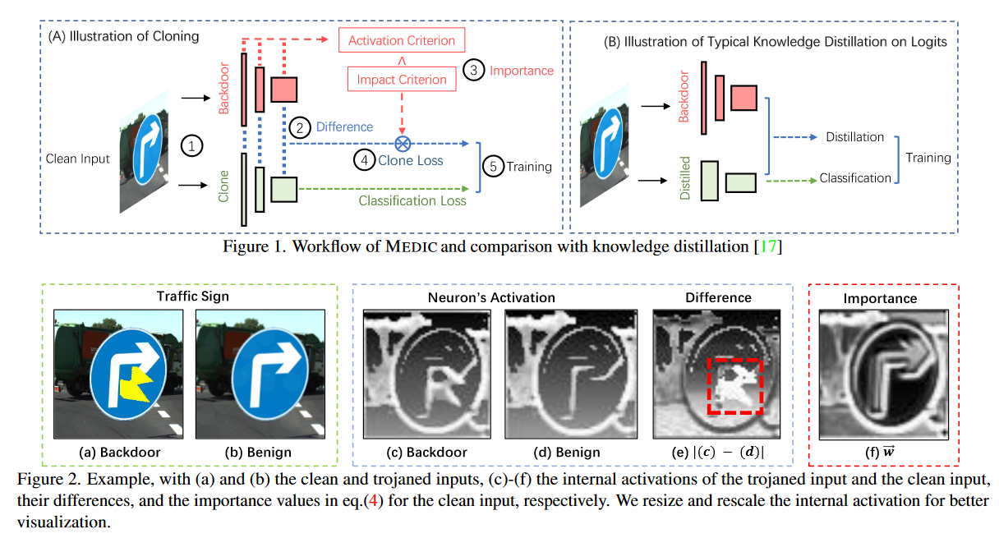
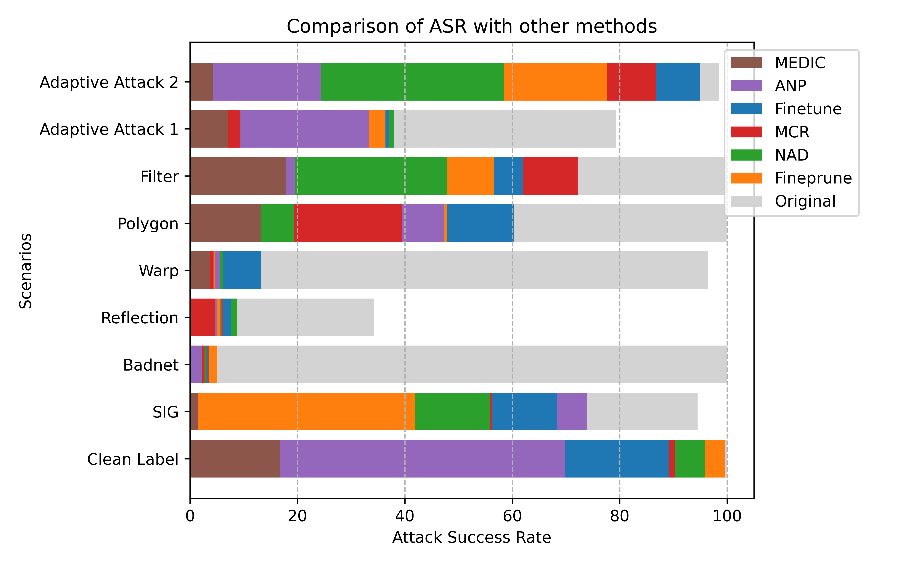

# MEDIC: Remove AI Backdoors via Cloning

MEDIC is a cloning based backdoor removal method. Different from fine-tuning based method, we retrain the model from scratch. We use layer-wise cloning to recover the clean accuracy and use importance to reduce the unnative behaviors. MEDIC exhibits strong advantage over strong backdoors that are deep in the model and harder to remove, e.g. the adversarial trained ones with data augmentation.



We compare our method over 5 baselines and 9 types of backdoor attack. The datasets includes CIFAR-10 and large-scale road dataset. 
We release different backdoor models from 6 different baselines and 5 different removal methods. We include codes for training, evaluating, and comparing the results.

Here is an example of results, where all methods are aligned to roughly similar accuracy.



A video introduction can be found [here](https://www.youtube.com/watch?v=dhIBzpDWNX0).

# Tutorial
Our scripts support training and removal on the baselines we showed in the paper except for TrojAI models including filter and polygon, which requires some time of configuration.
## Training

Our model is capable of training most of models we used. We also provide pre-trained backdoor models for testing purpose.

Here are the commands for training a backdoor model. 

| Backdoor Models      | Training Commands |
| ----------- | ----------- |
| Clean Label | python train_badnet.py --inject_portion=0.15 --checkpoint_root="./weight/cleanlabel" --clean_label  --epochs=100 --target_type="cleanLabel" |
| SIG | python train_badnet.py --inject_portion=0.1 --checkpoint_root="./weight/sig"  --epochs=30 --target_type="cleanLabel" --trigger_type="signalTrigger" |
| Warp | python train_badnet.py --inject_portion=0.3 --checkpoint_root="./weight/warp"  --epochs=30  --trigger_type="warpTrigger" |
| Adaptive 2 | python train_adaptive.py --inject_portion=0.05 --checkpoint_root="./weight/adapt" --target_label=0 |
| BADNET | python train_badnet.py --checkpoint_root="./weight/badnet"  --epochs=30 |


## Pre-trained Backdoor Models

Here are the pre-trained models
We released the model used for evaluation in the paper including the following.

| Backdoor Models      | Model Path | Model Specific Options |
| ----------- | ----------- | ----------- | 
| Adaptive Attack 1 | backdoor_models\adaptive_attack_1\composite_cifar_resnet.pth | --trigger_type='Composite' --target_label=2 |
| Adaptive Attack 2 | backdoor_models\adaptive_attack_2\WRN-16-1-S-model_best.pth.tar | --trigger_type='Adaptive' --s_name=WRN-16-1N --t_name=WRN-16-1N --target_label=0 |
| Warp Attack | backdoor_models\warp\WRN-16-1-S-model_best.pth.tar | --trigger_type='warpTrigger' --s_name=WRN-16-1 --t_name=WRN-16-1 --target_label=0 |
| Clean Label Attack | backdoor_models\cleanlabel\WRN-16-1-S-model_best.pth.tar | No additional options |
| BadNet | backdoor_models\badnet\WRN-16-1-S-model_best.pth.tar | No additional options |
| Reflection Attack | backdoor_models\reflection\WRN-16-1-S-model_best.pth.tar | --trigger_type='ReflectionTrigger' |

Note that to correctly evaluate these model, you have to add the corresponding options to the program, like trigger type or target label. Otherwise the result will be wrong. If you find the results way off, that is probably the reason.


## Step 2 


Remove Trigger using Medic, clean label attack as an example. You need to fill in the three blanks based on the model you use.

python main.py --hook  --converge --beta3=0 --beta2=0 --beta1=0 --isample='l2' --epochs=60 --lr=0.01  --ratio=0.05 --keepstat --norml2 --hookweight=10  --hook-plane="conv+bn" --imp_temp=5 --s_model="{MODEL_PATH}" --t_model="{MODEL_PATH}" {MODEL_SPECIFIC_OPTIONS_HERE}

Use clean label attack as an example, it becomes

python main.py --hook  --converge --beta3=0 --beta2=0 --beta1=0 --isample='l2' --epochs=60 --lr=0.01  --ratio=0.05 --keepstat --norml2 --hookweight=10  --hook-plane="conv+bn" --imp_temp=5 --s_model="backdoor_models\cleanlabel\WRN-16-1-S-model_best.pth.tar" --t_model="backdoor_models\cleanlabel\WRN-16-1-S-model_best.pth.tar" 

## Dependency

Our code is based the structure from https://github.com/bboylyg/NAD.

We include the backdoor attack training and evaluating.

Dependency:
- opencv-python
- pandas
- matplotlib
- scipy
- tqdm
- torchattacks

You can use pip install [depedency] to install these packages.

We test the code on Ubuntu 22.04, Pytorch 2.0.1, GTX 4090.

We require the specific dependent of package TrojAI for testing on Trojai model, https://pages.nist.gov/trojai/.
If you have that need, please feel free to uncomment the trojai import.

# Paper and citation

Paper can be found [here](https://openaccess.thecvf.com/content/CVPR2023/html/Xu_MEDIC_Remove_Model_Backdoors_via_Importance_Driven_Cloning_CVPR_2023_paper.html).

You are welcome to cite the paper if you find our work useful.
```
@InProceedings{Xu_2023_CVPR,
    author    = {Xu, Qiuling and Tao, Guanhong and Honorio, Jean and Liu, Yingqi and An, Shengwei and Shen, Guangyu and Cheng, Siyuan and Zhang, Xiangyu},
    title     = {MEDIC: Remove Model Backdoors via Importance Driven Cloning},
    booktitle = {Proceedings of the IEEE/CVF Conference on Computer Vision and Pattern Recognition (CVPR)},
    month     = {June},
    year      = {2023},
    pages     = {20485-20494}
}
```
